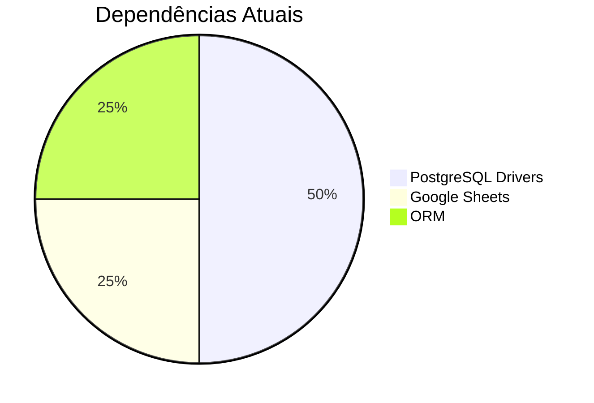

# Relatório Técnico: Análise do `pyproject.toml`

## 1. Visão Geral

O arquivo `pyproject.toml` é o arquivo de configuração moderno para projetos Python, seguindo a especificação PEP 518/621. Este relatório analisa as dependências e configurações do projeto EUFit.

---

## 2. Estrutura do Projeto

```toml
[project]
name = "eufit"
version = "0.1.0"
requires-python = ">=3.12"
dependencies = [...]
```

| Campo | Valor | Descrição |
|-------|-------|-----------|
| `name` | "eufit" | Nome do projeto |
| `version` | "0.1.0" | Versão atual (alpha) |
| `requires-python` | ">=3.12" | Requer Python 3.12+ |

---

## 3. Análise das Dependências

### 3.1 Dependências Obrigatórias

```toml
dependencies = [
    "gspread>=6.2.1",          # Google Sheets API
    "psycopg>=3.3.4",          # PostgreSQL adapter (v3)
    "psycopg2-binary==2.9.12", # PostgreSQL adapter (v2 - binary)
    "sqlalchemy==2.1.0b3",     # ORM (beta)
]
```

### 3.2 Análise Detalhada por Dependência

| Dependência | Versão | Propósito | Status |
|-------------|--------|-----------|--------|
| **gspread** | >=6.2.1 | Integração com Google Sheets | ✅ Atual |
| **psycopg** | >=3.3.4 | Driver PostgreSQL nativo (v3) | ✅ Moderno |
| **psycopg2-binary** | ==2.9.12 | Driver PostgreSQL (v2) | ⚠️ Versão fixa |
| **sqlalchemy** | ==2.1.0b3 | ORM para banco de dados | ⚠️ Versão beta |

---

## 4. Problemas Identificados

### 4.1 Duplicação de Drivers PostgreSQL

```toml
"psycopg>=3.3.4",          # Versão 3
"psycopg2-binary==2.9.12", # Versão 2
```

**Problema:** Duas versões diferentes do mesmo driver estão sendo instaladas, o que pode causar:
- Conflitos de versão
- Aumento no tamanho do projeto
- Possíveis incompatibilidades

**Recomendação:** Manter apenas um dos drivers:
- **Opção A:** Usar apenas `psycopg` (v3) - **RECOMENDADO**
- **Opção B:** Usar apenas `psycopg2-binary` (v2)

### 4.2 Versão Beta do SQLAlchemy

```toml
"sqlalchemy==2.1.0b3"  # beta 3
```

**Problema:** Versão beta em produção pode conter bugs não corrigidos.

**Recomendação:**
- Para produção: usar versão estável (ex: `sqlalchemy==2.0.35`)
- Para desenvolvimento: manter beta apenas se necessário

### 4.3 Dependência Faltante: `scikit-learn`

**Observação:** O arquivo `predictor.py` utiliza `sklearn.linear_model.LinearRegression`, mas o `pyproject.toml` não lista `scikit-learn` ou `scikit-learn-intelex`.

**Impacto:** O projeto não será instalado corretamente em novos ambientes, causando erro de importação.

**Recomendação:** Adicionar ao `pyproject.toml`:

```toml
"scikit-learn>=1.3.0",
"pandas>=2.0.0",
"numpy>=1.24.0"
```

### 4.4 Dependência Faltante: Flask ou Framework

**Observação:** O projeto usa `url_for`, `login_required`, e outros decorators típicos de Flask, mas o framework não está listado.

**Recomendação:** Adicionar:

```toml
"flask>=3.0.0",
"flask-login>=0.6.0",
"flask-sqlalchemy>=3.1.0"
```

---

## 5. Dependências Opcionais

```toml
[project.optional-dependencies]
dev = [
    "pytest>=8.0.0",
]
```

| Pacote | Versão | Propósito |
|--------|--------|-----------|
| pytest | >=8.0.0 | Framework de testes |

**Instalação:** `pip install -e .[dev]`

---

## 6. Configuração de Pacotes

```toml
[tool.setuptools.packages.find]
include = ["app*"]
```

**Propósito:** Inclui apenas pacotes que começam com "app" (ex: `app`, `app.database`, `app.ml`).

**Efeito:** Packages como `tests/`, `scripts/`, `docs/` não serão instalados.

---

## 7. Comparação: Dependências Atuais vs. Necessárias

### 7.1 Dependências Atuais



### 7.2 Dependências Necessárias (Completas)

| Categoria | Pacotes | Status |
|-----------|---------|--------|
| **Web Framework** | Flask, Flask-Login, Flask-SQLAlchemy | ❌ Faltando |
| **Banco de Dados** | psycopg, SQLAlchemy | ⚠️ Duplicado |
| **Machine Learning** | scikit-learn, pandas, numpy | ❌ Faltando |
| **Integração** | gspread | ✅ Presente |
| **Testes** | pytest | ✅ Presente (dev) |

---

## 8. Arquivo `pyproject.toml` Recomendado

```toml
[project]
name = "eufit"
version = "0.1.0"
requires-python = ">=3.12"
dependencies = [
    # Web Framework
    "flask>=3.0.0",
    "flask-login>=0.6.0",
    "flask-sqlalchemy>=3.1.0",
    "flask-migrate>=4.0.0",
    
    # Database
    "psycopg>=3.3.4",  # Apenas versão 3 (remover psycopg2-binary)
    "sqlalchemy>=2.0.35",  # Versão estável
    
    # Machine Learning
    "scikit-learn>=1.3.0",
    "pandas>=2.0.0",
    "numpy>=1.24.0",
    
    # Integrations
    "gspread>=6.2.1",
    
    # Utils
    "python-dotenv>=1.0.0",
]

[project.optional-dependencies]
dev = [
    "pytest>=8.0.0",
    "pytest-cov>=4.0.0",
    "black>=24.0.0",
    "flake8>=7.0.0",
]

[project.scripts]
eufit = "app.cli:main"

[tool.setuptools.packages.find]
include = ["app*"]

[tool.black]
line-length = 100
target-version = ['py312']

[tool.pytest.ini_options]
testpaths = ["tests"]
python_files = "test_*.py"
```

---

## 9. Matriz de Compatibilidade

| Pacote | Versão Atual | Versão Recomendada | Motivo |
|--------|--------------|-------------------|--------|
| psycopg | >=3.3.4 | >=3.3.4 | ✅ Manter |
| psycopg2-binary | ==2.9.12 | ❌ Remover | Duplicado |
| sqlalchemy | ==2.1.0b3 | >=2.0.35 | Beta → Estável |
| scikit-learn | ❌ Faltando | >=1.3.0 | ML Predictor |
| pandas | ❌ Faltando | >=2.0.0 | ML Predictor |
| flask | ❌ Faltando | >=3.0.0 | Framework |

---

## 10. Recomendações Finais

### 10.1 Ações Imediatas

- [ ] **Remover** `psycopg2-binary` (duplicado)
- [ ] **Atualizar** SQLAlchemy para versão estável
- [ ] **Adicionar** scikit-learn, pandas, numpy
- [ ] **Adicionar** Flask e extensões

### 10.2 Ações de Médio Prazo

- [ ] Adicionar linters e formatters (black, flake8)
- [ ] Adicionar `flask-migrate` para migrations
- [ ] Configurar scripts de entrada (`[project.scripts]`)

### 10.3 Verificação de Segurança

- [ ] Verificar se `psycopg2-binary==2.9.12` tem vulnerabilidades conhecidas
- [ ] Validar se a versão beta do SQLAlchemy tem CVE relatados

---

## 11. Impacto no Arquivo `predictor.py`

Com as recomendações implementadas:

| Dependência | Impacto no `predictor.py` |
|-------------|---------------------------|
| `scikit-learn` | ✅ Permite `from sklearn.linear_model import LinearRegression` |
| `pandas` | ✅ Permite `import pandas as pd` |
| `sqlalchemy` | ✅ Permite `from app.database.models import Eu2016` |
| `flask-sqlalchemy` | ✅ Permite `from app.modules.core.database import db` |

---

## 12. Resumo

| Aspecto | Status | Ação |
|---------|--------|------|
| Estrutura do projeto | ✅ OK | Nenhuma |
| Dependências de ML | ❌ Faltando | Adicionar |
| Dependências duplicadas | ⚠️ Sim | Remover |
| Versões estáveis | ⚠️ Parcial | Atualizar |
| Dependências de Web | ❌ Faltando | Adicionar |

**Conclusão:** O `pyproject.toml` está incompleto e contém dependências duplicadas/instáveis. Recomenda-se a atualização conforme sugerido para garantir que o projeto funcione em novos ambientes e que o módulo `predictor.py` possa ser executado sem erros de importação.
